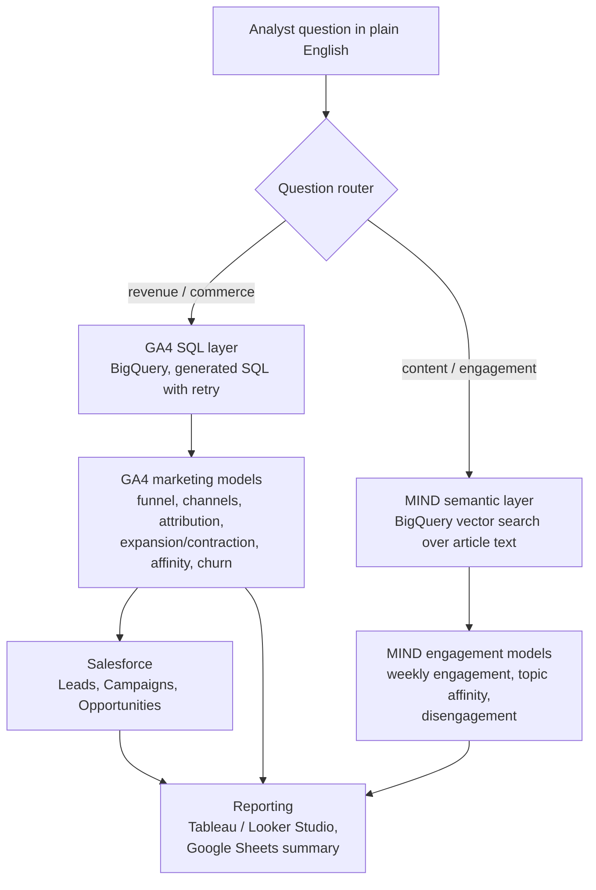

# Unified Customer Analytics

Marketing analytics platform built on two real, public datasets:

- **Google Analytics 4 e-commerce sample** (Google Merchandise Store, Nov 2020 – Jan 2021),
  queried in **BigQuery**: sessions, funnels, channels, campaigns and revenue.
- **Microsoft MIND** (Microsoft News): what readers click on and read, for content-marketing
  engagement analysis.

The two datasets come from different businesses and are **never merged**: GA4 and MIND
users are not the same people. They are analyzed side by side, with the same time periods,
the same user-grouping logic and one reporting layer. This mirrors an analyst who supports
both a commerce business and a content business at the same company.

## Architecture



| Layer | Tool |
|---|---|
| Warehouse and modeling | Google BigQuery |
| Web / commerce data | Google Analytics 4 (public obfuscated sample) |
| Content engagement data | Microsoft MIND |
| CRM | Salesforce Developer Edition |
| Dashboards | Tableau, Looker Studio |
| Stakeholder report | Google Sheets + Apps Script |
| AI question layer | LLM API |

## Status

| Part | State |
|---|---|
| Project setup, config, CLI, CI | Done |
| GA4 marketing models (BigQuery SQL) | Done, tested offline; not yet run in BigQuery |
| MIND ingestion and engagement models | Planned |
| Salesforce data model and load | Planned |
| AI question router and semantic search | Planned |
| Tableau / Looker Studio / Sheets reporting | Planned |

## GA4 models

Built in this order from `sql/ga4/`. Full definitions are in
[docs/methodology.md](docs/methodology.md).

| Model | One row per | Answers |
|---|---|---|
| `stg_ga4__events` | event | Flattened GA4 events with session key and traffic fields |
| `stg_ga4__purchases` | transaction | Purchases, with duplicate purchase events removed |
| `stg_ga4__items` | item on a funnel event | Products viewed, carted, checked out, bought |
| `int_ga4__sessions` | session | Source / medium / campaign, channel, funnel stage reached, revenue |
| `mart_funnel_daily` | day × channel × device | Where in the funnel sessions drop off |
| `mart_channel_performance` | channel × source × medium × campaign | Sessions, conversion rate, revenue, AOV |
| `mart_attribution` | model × channel | Revenue by first-touch, last-touch and linear attribution |
| `mart_user_weekly_revenue` | user × purchasing week | Expansion / Contraction / Flat, week over week |
| `mart_user_revenue_trend` | purchasing user | Each customer's latest trend and total revenue |
| `mart_product_affinity` | product pair | Products bought together (support, confidence, lift) |
| `mart_next_category` | segment × category pair | Which new category customers buy next |
| `mart_user_rfm_churn` | user | RFM scores, segments, churn and lapsed-purchaser flags |
| `mart_cohort_retention` | cohort week × week number | Weekly retention by acquisition cohort |
| `dq_ga4__placeholder_share` | field | How much of each field is obfuscated or missing |

## Quickstart

Requires Python 3.10+.

```bash
python -m venv .venv && source .venv/bin/activate
pip install -e ".[dev]"
pytest            # offline tests, no Google Cloud account needed
```

### Build the models in BigQuery

1. Create a Google Cloud project and enable the BigQuery API. The GA4 sample is public;
   your project only pays for the queries you run, and BigQuery's free tier includes
   1 TB of queries per month. `uca build` prints the data processed by each model.
2. Authenticate: `gcloud auth application-default login`
   (or set `GOOGLE_APPLICATION_CREDENTIALS` to a service-account key).
3. `cp .env.example .env` and set `GCP_PROJECT`.
4. Run:

```bash
uca compile   # write the rendered BigQuery SQL to target/compiled/ga4/ for review
uca build     # create the tables in GCP_PROJECT.marketing_analytics
uca build --select mart_attribution   # rebuild one model (upstream tables must exist)
```

Each query is capped at `BQ_MAX_BYTES_BILLED` (50 GB by default) as a cost guard.

## How the tests work

The models are written once, in BigQuery SQL. For tests, each one is translated to DuckDB
with [sqlglot](https://github.com/tobymao/sqlglot) and run against a small, hand-built GA4
events table (`tests/ga4_fixture.py`) whose correct answers were worked out by hand. The
tests check those answers exactly: duplicate purchases, attribution splits, trend labels,
affinity scores, churn flags and cohort retention. A separate test checks that every model
renders to valid BigQuery SQL.

Offline tests cannot catch everything that could differ in BigQuery itself, so the first
real `uca build` should be reviewed alongside `dq_ga4__placeholder_share`.

## Project layout

```
sql/ga4/          GA4 models, numbered in build order (BigQuery SQL + Jinja helpers)
src/uca/          Python package: settings, SQL rendering, BigQuery/DuckDB runners, CLI
tests/            Offline tests and the hand-built GA4 fixture
docs/             Methodology, definitions and data limitations
```

## Data sources and licenses

- **GA4:** `bigquery-public-data.ga4_obfuscated_sample_ecommerce`, published by Google through
  the BigQuery public datasets program. Google describes it as obfuscated sample data with
  limited internal consistency; see [docs/methodology.md](docs/methodology.md#data-limitations).
- **MIND:** [msnews.github.io](https://msnews.github.io/), Microsoft Research License Terms,
  non-commercial research use only. MIND files are **not** stored in this repository
  (`data/` and `*.tsv` are git-ignored). MIND has no revenue fields, so no dollar figure is
  ever derived from it.

The code in this repository is MIT-licensed. The license does not cover either dataset.
