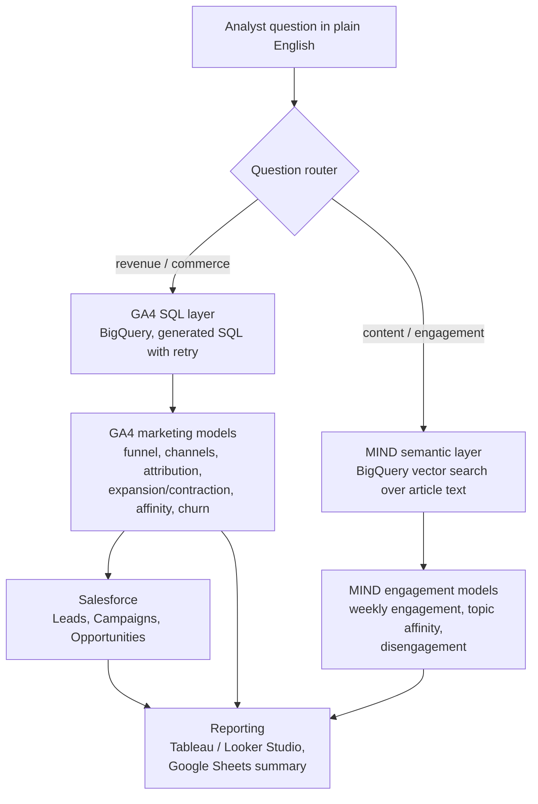
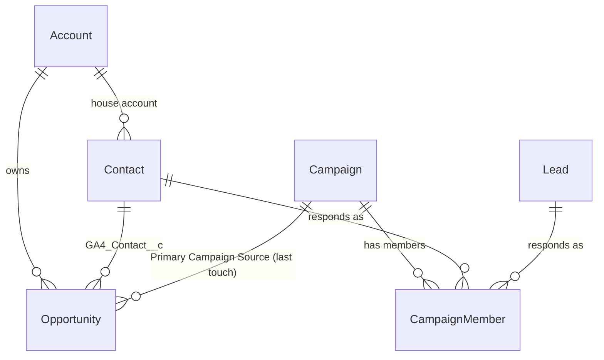

# Unified Customer Analytics

Marketing analytics platform built on two real, public datasets:

- **Google Analytics 4 e-commerce sample** (Google Merchandise Store, Nov 2020 – Jan 2021),
  queried in **BigQuery**: sessions, funnels, channels, campaigns and revenue.
- **Microsoft MIND** (Microsoft News): what readers click on and read, for content-marketing
  engagement analysis.

The two datasets come from different businesses and are **never merged**: GA4 and MIND
users are not the same people. They are analyzed side by side, with the same time periods,
the same user-grouping logic and one reporting layer. This mirrors an analyst who supports
both a commerce business and a content business at the same company.

## Architecture



| Layer | Tool |
|---|---|
| Warehouse and modeling | Google BigQuery |
| Web / commerce data | Google Analytics 4 (public obfuscated sample) |
| Content engagement data | Microsoft MIND |
| CRM | Salesforce Developer Edition |
| Dashboards | Tableau, Looker Studio |
| Stakeholder report | Google Sheets + Apps Script |
| AI question layer | Claude (Anthropic API) |

## Status

| Part | State |
|---|---|
| Project setup, config, CLI, CI | Done |
| GA4 marketing models (BigQuery SQL) | Done, tested offline; not yet run in BigQuery |
| MIND download, loading and engagement models | Done, tested offline; not yet run on the real files |
| Salesforce data model, metadata and load | Done, tested offline; not yet deployed to an org |
| AI question router, self-correcting SQL and semantic search | Done, tested offline; not yet run against Claude or BigQuery |
| Tableau / Looker Studio / Sheets reporting | Planned |

## GA4 models

Built in this order from `sql/ga4/`. Full definitions are in
[docs/methodology.md](docs/methodology.md).

| Model | One row per | Answers |
|---|---|---|
| `stg_ga4__events` | event | Flattened GA4 events with session key and traffic fields |
| `stg_ga4__purchases` | transaction | Purchases, with duplicate purchase events removed |
| `stg_ga4__items` | item on a funnel event | Products viewed, carted, checked out, bought |
| `int_ga4__sessions` | session | Source / medium / campaign, channel, funnel stage reached, revenue |
| `mart_funnel_daily` | day × channel × device | Where in the funnel sessions drop off |
| `mart_channel_performance` | channel × source × medium × campaign | Sessions, conversion rate, revenue, AOV |
| `mart_attribution` | model × channel | Revenue by first-touch, last-touch and linear attribution |
| `mart_user_weekly_revenue` | user × purchasing week | Expansion / Contraction / Flat, week over week |
| `mart_user_revenue_trend` | purchasing user | Each customer's latest trend and total revenue |
| `mart_product_affinity` | product pair | Products bought together (support, confidence, lift) |
| `mart_next_category` | segment × category pair | Which new category customers buy next |
| `mart_user_rfm_churn` | user | RFM scores, segments, churn and lapsed-purchaser flags |
| `mart_cohort_retention` | cohort week × week number | Weekly retention by acquisition cohort |
| `dq_ga4__placeholder_share` | field | How much of each field is obfuscated or missing |

## MIND models

Built in this order from `sql/mind/`, after the raw files are loaded. These are
engagement measures only: MIND has no revenue data. Definitions are in
[docs/methodology.md](docs/methodology.md#mind).

| Model | One row per | Answers |
|---|---|---|
| `stg_mind__news` | article | Category, subcategory, title, abstract, entities |
| `stg_mind__impressions` | impression | When a reader was shown a list of articles |
| `stg_mind__impression_items` | article shown | Whether the reader clicked it |
| `stg_mind__history` | past click | What each reader clicked before the log started |
| `mart_mind__user_daily_engagement` | reader × active day | Clicks, click-through rate, engagement expansion / contraction |
| `mart_mind__user_engagement_trend` | reader | Each reader's totals and latest engagement trend |
| `mart_mind__category_performance` | category × subcategory | Which content gets shown and clicked |
| `mart_mind__topic_drift` | reader × category | Who is drifting away from (or toward) a category |
| `mart_mind__user_disengagement` | reader | Engaged, Passive or Disengaged at the end of the log |
| `mart_mind__pre_disengagement_reads` | at-risk reader × article | The last 10 articles at-risk readers clicked (input for the AI layer) |
| `dq_mind__summary` | one row | Coverage and gaps in the MIND files |

## Salesforce

GA4 results are pushed into a Salesforce Developer Edition org so marketing results sit
next to CRM records. Details and the full field list: [docs/salesforce.md](docs/salesforce.md).



| Salesforce object | From GA4 | Built by |
|---|---|---|
| Campaign | Each channel + campaign, with sessions, users, orders, revenue and conversion rate from **all** GA4 data | `sf_campaigns` |
| Contact | Purchasers: RFM scores and segment, revenue trend, churn flags, next best category | `sf_contacts` |
| Lead | Non-purchasers who added to cart or started checkout | `sf_leads` |
| Opportunity | Each order, Closed Won, with last-touch campaign and first/last-touch channels | `sf_opportunities` |
| CampaignMember | Which campaigns each person arrived through (Responded / Sent) | `sf_campaign_members` |
| Account | One house account for all online customers | `sf_accounts` |

A Developer Edition org holds only about 5 MB (~2,500 records), so a repeatable sample of
people is loaded (400 contacts and 200 leads by default, with their orders and campaign
memberships). Campaign figures still cover everyone. The records are pseudonymous: GA4 has
no names or emails, and none are invented.

## AI questions

`uca ask "<question>"` answers plain-English questions. Claude plans the steps, writes
BigQuery SQL that is checked before it runs (read-only, mart tables only, row-capped) and
corrected automatically when it fails, searches MIND articles by meaning, and writes an
answer from the results. GA4 and MIND are reported side by side, never joined. Details:
[docs/ai.md](docs/ai.md).

```bash
uca ask "Which campaigns convert best, and how does first-touch revenue differ from last-touch?"
uca ask "Which readers are drifting away from sports, and what were they reading?" --show-sql
```

## Quickstart

Requires Python 3.10+.

```bash
python -m venv .venv && source .venv/bin/activate
pip install -e ".[dev]"
pytest            # offline tests, no Google Cloud account needed
```

### Build the models in BigQuery

1. Create a Google Cloud project and enable the BigQuery API. The GA4 sample is public;
   your project only pays for the queries you run, and BigQuery's free tier includes
   1 TB of queries per month. `uca build` prints the data processed by each model.
2. Authenticate: `gcloud auth application-default login`
   (or set `GOOGLE_APPLICATION_CREDENTIALS` to a service-account key).
3. `cp .env.example .env` and set `GCP_PROJECT`.
4. Run:

```bash
uca compile ga4   # write the rendered BigQuery SQL to target/compiled/ga4/ for review
uca build ga4     # create the tables in GCP_PROJECT.marketing_analytics
uca build ga4 --select mart_attribution   # rebuild one model (upstream tables must exist)
```

Each query is capped at `BQ_MAX_BYTES_BILLED` (50 GB by default) as a cost guard.

### Load MIND and build its models

```bash
uca mind-download   # MIND-small train + dev into data/mind/ (git-ignored)
uca mind-load       # load them into BigQuery as mind_raw_news and mind_raw_behaviors
uca build mind      # build the MIND models
```

If the download fails, download MIND-small from [msnews.github.io](https://msnews.github.io/)
(or its Kaggle mirror) and unzip each split so the files sit at
`data/mind/train/{news,behaviors}.tsv` and `data/mind/dev/{news,behaviors}.tsv`.
Set `MIND_VARIANT=large` for the full dataset (about 1 million readers).

`uca build` with no group builds GA4, MIND and then the Salesforce tables.

### Load Salesforce

See [docs/salesforce.md](docs/salesforce.md#setup) for the one-time org setup (deploying
the custom fields and assigning the permission set). Then:

```bash
uca build salesforce   # shape GA4 results into sf_* tables in BigQuery
uca sf-load            # upsert them into Salesforce (safe to re-run)
```

## How the tests work

The models are written once, in BigQuery SQL. For tests, each one is translated to DuckDB
with [sqlglot](https://github.com/tobymao/sqlglot) and run against small, hand-built samples
whose correct answers were worked out by hand: a GA4 events table (`tests/ga4_fixture.py`)
and MIND TSV files in the real layout (`tests/mind_fixture.py`, loaded through the same
reader used for the real files). The tests check those answers exactly: duplicate purchases,
attribution splits, trend labels, affinity scores, churn flags, cohort retention, topic drift
and disengagement. A separate test checks that every model renders to valid BigQuery SQL.

Offline tests cannot catch everything that could differ in BigQuery itself, so the first
real `uca build` should be reviewed alongside `dq_ga4__placeholder_share` and
`dq_mind__summary`.

## Project layout

```
sql/ga4/          GA4 models, numbered in build order (BigQuery SQL + Jinja helpers)
sql/mind/         MIND models, numbered in build order
sql/salesforce/   GA4 results shaped into Salesforce objects
src/uca/ai/       AI question layer: router, SQL guard, self-correcting SQL agent, semantic search
salesforce/       Salesforce DX project: custom fields and permission set to deploy
src/uca/          Python package: settings, SQL rendering, runners, MIND and Salesforce loaders, CLI
tests/            Offline tests and the hand-built GA4 and MIND samples
docs/             Methodology, definitions and data limitations
```

## Data sources and licenses

- **GA4:** `bigquery-public-data.ga4_obfuscated_sample_ecommerce`, published by Google through
  the BigQuery public datasets program. Google describes it as obfuscated sample data with
  limited internal consistency; see [docs/methodology.md](docs/methodology.md#data-limitations).
- **MIND:** [msnews.github.io](https://msnews.github.io/), Microsoft Research License Terms,
  non-commercial research use only. MIND files are **not** stored in this repository
  (`data/` and `*.tsv` are git-ignored). MIND has no revenue fields, so no dollar figure is
  ever derived from it.

The code in this repository is MIT-licensed. The license does not cover either dataset.
