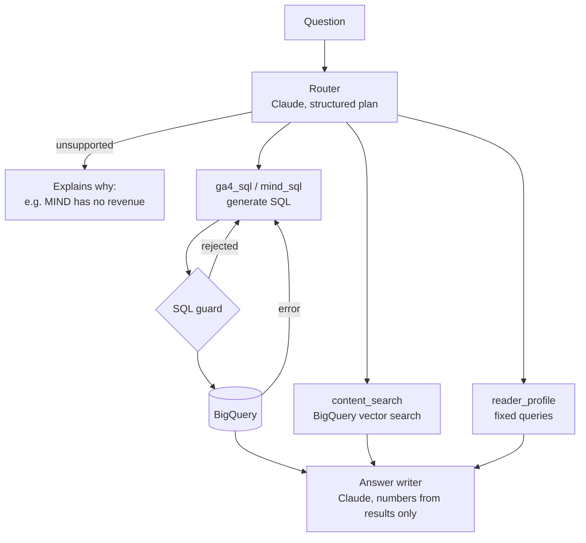

# AI question layer

`uca ask "<question>"` answers plain-English questions from the GA4 and MIND tables.

```bash
uca ask "Which channel brings the most revenue under first touch vs last touch?"
uca ask "Which readers are drifting away from sports, and what were they reading?" --show-sql
uca ask "Summarize reader U13740's engagement"
```

It prints the answer, caveats, and each step it ran (with the SQL when `--show-sql` is set).

## How it works



1. **Router.** Claude turns the question into 1–4 steps, each on one dataset. A compound
   question (a number *and* a text answer) becomes several steps. Questions the data
   cannot answer (money from MIND, treating GA4 shoppers and MIND readers as the same
   people, anything outside these tables) are declined with a reason, and nothing runs.
2. **Steps.**
   - `ga4_sql` / `mind_sql`: Claude writes BigQuery SQL for that dataset's tables.
   - `content_search`: semantic search over MIND article titles and abstracts.
   - `reader_profile`: fixed, parameter-checked queries for one MIND reader (engagement
     trend, status, topic drift, recent reads).
3. **Answer.** Claude writes a short answer using only numbers present in the step results,
   reports GA4 and MIND side by side, and adds caveats.

## Governance

Generated SQL never runs unchecked. `src/uca/ai/guard.py` accepts a query only if:

- it is a single read-only `SELECT` (CTEs and `UNION` allowed; no DML/DDL, no scripts);
- it reads only that dataset's **mart and data-quality tables**, by bare name. Staging
  tables, the Salesforce tables, other datasets, `INFORMATION_SCHEMA`, `ML.*` and
  `EXTERNAL_QUERY` are rejected;
- it returns at most `AI_MAX_ROWS` rows (a `LIMIT` is added or lowered).

The dataset is added to table names only after the check, and every query runs with the
`BQ_MAX_BYTES_BILLED` cap. The table descriptions Claude sees are the comment blocks at
the top of each SQL model, so the definitions it follows are the documented ones, and
column lists are read from BigQuery, so they are always current.

## Self-correcting SQL

If a query is rejected by the guard or fails in BigQuery (an unknown column, a type error),
the SQL and the error go back to Claude, which writes a corrected query. This repeats up
to `AI_MAX_SQL_ATTEMPTS` times (default 3). The number of attempts is shown per step.

## Semantic search setup (one time)

Semantic search uses BigQuery ML: article text is embedded with a Vertex AI embedding
model, and questions are matched with `VECTOR_SEARCH`. Everything stays in BigQuery.

1. Create a Vertex AI connection and let it call Vertex AI:
   ```bash
   bq mk --connection --location=US --project_id=YOUR_PROJECT \
     --connection_type=CLOUD_RESOURCE vertex_ai
   bq show --connection YOUR_PROJECT.us.vertex_ai   # note the service account
   ```
   In IAM, grant that service account the **Vertex AI User** role.
2. Create the remote embedding model (in the BigQuery console):
   ```sql
   CREATE OR REPLACE MODEL `YOUR_PROJECT.marketing_analytics.mind_text_embedding`
     REMOTE WITH CONNECTION `YOUR_PROJECT.us.vertex_ai`
     OPTIONS (ENDPOINT = 'text-embedding-005');
   ```
   Use the current Vertex AI text-embedding model if that one has been superseded.
3. After `uca build mind`, embed the articles:
   ```bash
   uca build-embeddings   # creates mind_article_embeddings
   ```

Without this setup, `uca ask` still works; content-search steps report that search is not
set up. Use `--no-search` to skip it entirely.

## Model and cost

- Claude model: `UCA_LLM_MODEL` (default `claude-opus-5`). Set `ANTHROPIC_API_KEY`, or
  log in with `ant auth login`.
- Each question makes one Claude call to plan, one per SQL attempt, and one to write the
  answer. Planning and answer writing run at `medium` effort; SQL generation at `high`.
- The instructions and table catalog form a stable system prompt, which is cached.
- Responses are structured (validated against Pydantic models). If Claude declines a
  request, it is retried on Anthropic's recommended fallback model (`fallbacks: "default"`);
  if that also declines, the command reports it.

## Testing

`tests/test_ai.py` runs offline: a scripted stand-in replaces Claude, and DuckDB holds the
GA4 and MIND test data. It covers the guard (accepted and rejected queries, row caps),
the catalog, the self-correction loop (a failing column, a rejected staging table, giving
up after the limit), compound and unsupported questions, reader profiles (including an
injection attempt in the reader id), the exact Claude request (model, structured output,
fallbacks, caching) and refusal handling, and that search passes the question as a query
parameter rather than pasting it into SQL.

These tests prove the plumbing, not answer quality. Nothing here has called Claude or
BigQuery for real yet; the first real runs should be checked with `--show-sql`.
